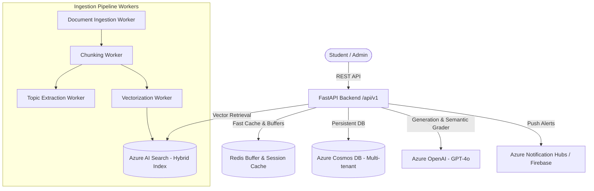
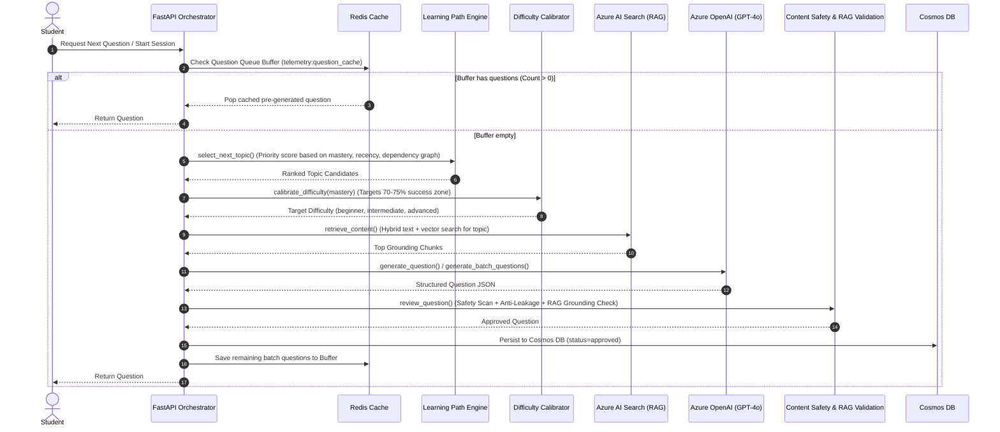
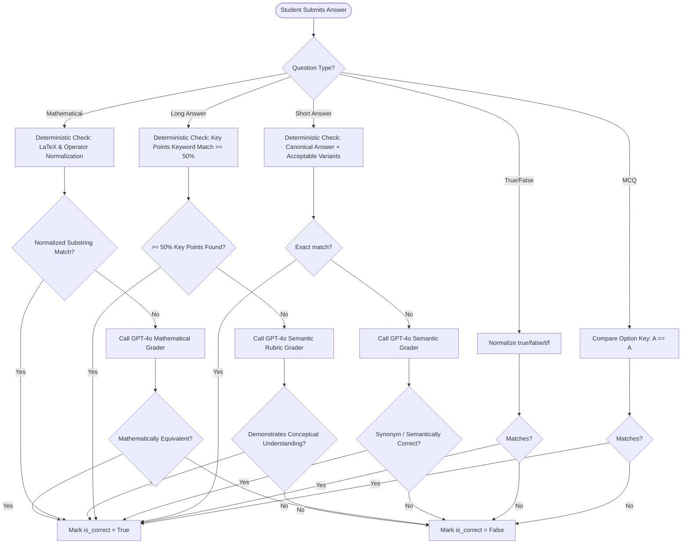

# Backend Architecture, Session Generation & Answer Evaluation Guide

This document provides a comprehensive technical breakdown of how the backend works, how adaptive study sessions are generated, how student answers are matched as **right or wrong**, and how analytics and knowledge state tracking operate.

---

## 1. High-Level Backend Architecture

The backend is built with **FastAPI**, **MongoDB/Azure Cosmos DB**, **Redis**, **Azure OpenAI (GPT-4o)**, and **Azure AI Search**.

### Key Components:
- **Multi-Tenant DB Structure**: Each tenant has their own Cosmos DB database, ensuring data isolation.
- **Workers Pipeline**: Uploaded study documents $\rightarrow$ OCR/Extraction $\rightarrow$ Chunks (2,000 chars with 200 overlap) $\rightarrow$ Embeddings (text-embedding-3) into Azure AI Search and Topic Extraction into Taxonomy.
- **Adaptive Engine**: Selects the next best topic and difficulty based on student mastery and history.
- **RAG Engine**: Retrieves source chunks from Azure AI Search to strictly ground every generated question and flashcard.

---

## 2. How Study Sessions Are Generated

Adaptive sessions (`POST /workspaces/{workspace_id}/adaptive-sessions/start` or `POST /questions/next`) follow a multi-stage pipeline:

### Steps in Detail:
1. **Fast-Path Cache Check (`Redis`)**:
   - Each student in a workspace has a Redis queue (`telemetry:question_cache:{workspace_id}:{student_id}`).
   - If questions exist, the first item is popped and served in **< 10 ms**.
   - If the remaining count drops $\le 5$, an asynchronous background task (`prefetch_batch_background`) is spawned to refill the buffer.
2. **Adaptive Topic Selection (`Learning Path Engine`)**:
   - Queries `retrieve_student_context` for recent student interactions and mastery.
   - Calculates a priority score for each topic:
     $$\text{Priority} = \text{Weakness Weight} \times (1.0 - \text{Mastery}) + \text{Decay Weight} \times \text{Days Since Last Studied} + \text{Curriculum Weight}$$
   - Resolves dependency prerequisites (a student must master prerequisite topics first).
3. **Difficulty Calibration (`Difficulty Calibrator`)**:
   - Maps student mastery to cognitive difficulty targets:
     - $\text{Mastery} < 0.40 \rightarrow \text{beginner}$ (Bloom's: Remember/Understand, direct recall).
     - $0.40 \le \text{Mastery} \le 0.70 \rightarrow \text{intermediate}$ (Bloom's: Apply/Analyse, multi-concept).
     - $\text{Mastery} > 0.70 \rightarrow \text{advanced}$ (Bloom's: Evaluate/Create, synthesis & edge cases).
4. **Grounded Retrieval (RAG)**:
   - Fetches the top relevant chunks from Azure AI Search filtered by `workspace_id`, canonical `topic_ids`, and active document IDs.
5. **AI Generation & Verification**:
   - Formats grounding chunks and invokes GPT-4o with type-specific prompt templates (`question_mcq_v1`, `question_short_answer_v1`, etc.).
   - Runs **Content Safety** and **RAG Grounding Validation** to ensure the question is uncompromised and factually faithful to source materials.

---

## 3. How Answers Are Evaluated: Right or Wrong

When a student submits an answer (`POST /workspaces/{workspace_id}/questions/{id}/answer`), the evaluation logic in [`app/services/answer_evaluation.py`](file:///c:/Users/tarun/Downloads/Social-studying-app/social-studying-app/backend/app/services/answer_evaluation.py) executes:

### Evaluation Flow by Question Type:

---

### Is LLM Called to Match User Answer with Correct Answer?

> [!IMPORTANT]
> **YES, with RAG Grounding Context from Course Materials.**
>
> 1. **Fast Deterministic Check First (0ms, $0 cost)**:
>    - For **MCQ** and **True/False**: 100% deterministic (no LLM call is ever made).
>    - For **Short Answer** and **Long Answer**: The engine first runs fast string/regex/Unicode normalization and keyword-overlap checks. If the student typed the expected answer, acceptable variants, or $\ge 50\%$ key points directly, it is marked **correct immediately** without calling the LLM.
>
> 2. **RAG-Grounded Semantic LLM Evaluation (for Short & Long Answers)**:
>    - If deterministic matching does not immediately pass on free-response questions, the backend invokes GPT-4o (`azure_openai.chat_json`) with `temperature=0.0` and **injects the original study material source chunks (RAG context)** into the prompt.
>    - **Short Answer Grounding**: Checks if the student's answer is a valid synonym, alternative valid term, or accurately states a fact directly supported by the study material source context (e.g. *"spirilla"* vs *"spirochetes"*).
>    - **Long Answer Grounding**: Evaluates the student's explanation against the full course material context and rubric hints, awarding full credit for paraphrased explanations or valid details supported by the source document.
>    - **Actionable Feedback**: Generates educational `feedback` explaining what concepts were well-grounded or what points were missed.

---

## 4. How Analysis, Mastery & Gamification Work

Once the answer verdict (`is_correct`) is determined, post-submission processors trigger immediately:

### 1. Knowledge State & Mastery Update (`knowledge_state.py`)
Mastery for the question's topic is updated in the student's `KnowledgeState` using a **Weighted Exponential Moving Average (EMA)**:

$$\text{Mastery}_{\text{new}} = \alpha \times \text{Score}_{\text{interaction}} + (1 - \alpha) \times \text{Mastery}_{\text{old}}$$

- Correct answers increase the topic's mastery score towards $1.0$.
- Incorrect answers decrease the topic's mastery score.
- The updated score immediately feeds into the next question's topic and difficulty calibration.

### 2. Gamification & Rewards (`gamification.py`)
- **XP Calculation**:
  - Base Attempt XP: Awarded for every answer to encourage participation.
  - Correctness XP: Scaled based on question difficulty ($10\text{ XP}$ for beginner, $20\text{ XP}$ for intermediate, $35\text{ XP}$ for advanced).
  - Streak Multipliers: Consecutive correct answers multiply earned XP.
- **Level Progression**: XP thresholds advance the student's level.
- **Badge Engine**: Checks conditions (e.g., *"First 10 Questions Answered"*, *"3-Day Study Streak"*, *"Master of Photosynthesis"*).
- **Leaderboards**: Updates weekly and all-time student rankings in the workspace.

### 3. Analytics & Progress Dashboards (`analytics.py`)
- **Student Analytics**: Tracks mastery progression over time, accuracy rate, velocity (questions/day), weak topics list, and SRS revision schedules.
- **Workspace/Teacher Analytics**: Aggregates topic mastery distributions across the entire class, highlighting topics where students struggle.
- **Tenant Analytics**: Provides high-level activity metrics, engagement rates, and content utilization.
